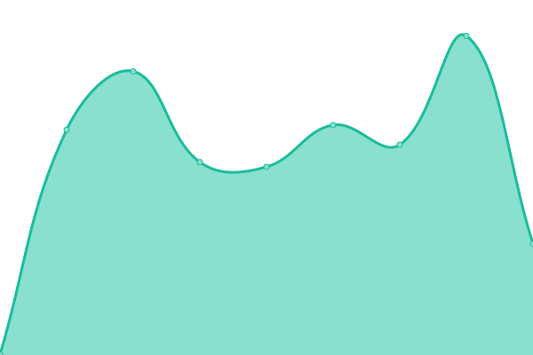
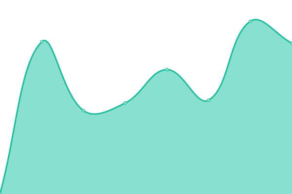
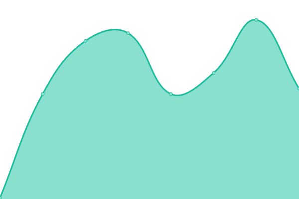

# [📈 Live Status](https://status.revolt.chat): <!--live status--> **🟩 All systems operational**

This repository contains the open-source uptime monitor and status page for [revolt-chat](https://status.revolt.chat), powered by [Upptime](https://github.com/upptime/upptime).

With [Upptime](https://upptime.js.org), you can get your own unlimited and free uptime monitor and status page, powered entirely by a GitHub repository. We use [Issues](https://github.com/revolt-chat/status/issues) as incident reports, [Actions](https://github.com/revolt-chat/status/actions) as uptime monitors, and [Pages](https://status.revolt.chat) for the status page.

<!--start: status pages-->
<!-- This summary is generated by Upptime (https://github.com/upptime/upptime) -->
<!-- Do not edit this manually, your changes will be overwritten -->
<!-- prettier-ignore -->
| URL | Status | History | Response Time | Uptime |
| --- | ------ | ------- | ------------- | ------ |
|  [Web Frontend (Revite)](https://app.revolt.chat) | 🟩 Up | [web-frontend-revite.yml](https://github.com/revolt-chat/status/commits/HEAD/history/web-frontend-revite.yml) | 

 738ms
     
 | 

<a href="https://status.revolt.chat/history/web-frontend-revite">100.00%</a>
    

|  [API (Delta)](https://api.revolt.chat) | 🟩 Up | [api-delta.yml](https://github.com/revolt-chat/status/commits/HEAD/history/api-delta.yml) | 

 770ms
     
 | 

<a href="https://status.revolt.chat/history/api-delta">100.00%</a>
    

|  [CDN (Autumn)](https://autumn.revolt.chat) | 🟩 Up | [cdn-autumn.yml](https://github.com/revolt-chat/status/commits/HEAD/history/cdn-autumn.yml) | 

 384ms
     
 | 

<a href="https://status.revolt.chat/history/cdn-autumn">0.00%</a>
    

|  [Proxy Service (January)](https://jan.revolt.chat) | 🟩 Up | [proxy-service-january.yml](https://github.com/revolt-chat/status/commits/HEAD/history/proxy-service-january.yml) | 

 710ms
     
 | 

<a href="https://status.revolt.chat/history/proxy-service-january">100.00%</a>
    

|  [Voice (Vortex)](https://vortex.revolt.chat) | 🟩 Up | [voice-vortex.yml](https://github.com/revolt-chat/status/commits/HEAD/history/voice-vortex.yml) | 

 826ms
     
 | 

<a href="https://status.revolt.chat/history/voice-vortex">100.00%</a>
    

|  [Static Resources](https://static.revolt.chat) | 🟩 Up | [static-resources.yml](https://github.com/revolt-chat/status/commits/HEAD/history/static-resources.yml) | 

 627ms
     
 | 

<a href="https://status.revolt.chat/history/static-resources">100.00%</a>
    

|  Mail | 🟩 Up | [mail.yml](https://github.com/revolt-chat/status/commits/HEAD/history/mail.yml) | 

 144ms
     
 | 

<a href="https://status.revolt.chat/history/mail">100.00%</a>
    

<!--end: status pages-->

[**Visit our status website →**](https://status.revolt.chat)

## 📄 License

- Powered by: [Upptime](https://github.com/upptime/upptime)
- Code: [MIT](./LICENSE) © [revolt-chat](https://status.revolt.chat)
- Data in the `./history` directory: [Open Database License](https://opendatacommons.org/licenses/odbl/1-0/)
