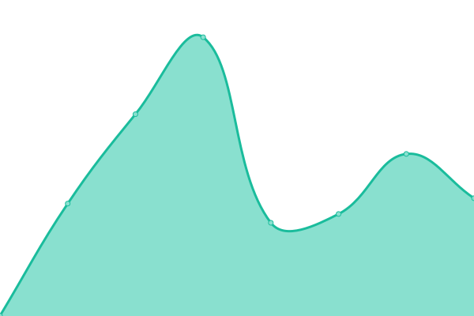

# [📈 Live Status](https://status.revolt.chat): <!--live status--> **🟩 All systems operational**

This repository contains the open-source uptime monitor and status page for [revolt-chat](https://status.revolt.chat), powered by [Upptime](https://github.com/upptime/upptime).

With [Upptime](https://upptime.js.org), you can get your own unlimited and free uptime monitor and status page, powered entirely by a GitHub repository. We use [Issues](https://github.com/revolt-chat/status/issues) as incident reports, [Actions](https://github.com/revolt-chat/status/actions) as uptime monitors, and [Pages](https://status.revolt.chat) for the status page.

<!--start: status pages-->
<!-- This summary is generated by Upptime (https://github.com/upptime/upptime) -->
<!-- Do not edit this manually, your changes will be overwritten -->
<!-- prettier-ignore -->
| URL | Status | History | Response Time | Uptime |
| --- | ------ | ------- | ------------- | ------ |
|  [API](https://api.revolt.chat) | 🟩 Up | [api.yml](https://github.com/revolt-chat/status/commits/HEAD/history/api.yml) | 

 442ms
     
 | 

<a href="https://status.revolt.chat/history/api">99.14%</a>
    

|  [CDN](https://autumn.revolt.chat?t=1) | 🟩 Up | [cdn.yml](https://github.com/revolt-chat/status/commits/HEAD/history/cdn.yml) | 

 9948ms
     
 | 

<a href="https://status.revolt.chat/history/cdn">100.00%</a>
    

|  [Voice](https://vortex.revolt.chat) | 🟩 Up | [voice.yml](https://github.com/revolt-chat/status/commits/HEAD/history/voice.yml) | 

 475ms
     
 | 

<a href="https://status.revolt.chat/history/voice">100.00%</a>
    

|  [Proxy Service](https://jan.revolt.chat) | 🟩 Up | [proxy-service.yml](https://github.com/revolt-chat/status/commits/HEAD/history/proxy-service.yml) | 

 326ms
     
 | 

<a href="https://status.revolt.chat/history/proxy-service">100.00%</a>
    

|  [Client](https://app.revolt.chat) | 🟩 Up | [client.yml](https://github.com/revolt-chat/status/commits/HEAD/history/client.yml) | 

 467ms
     
 | 

<a href="https://status.revolt.chat/history/client">99.14%</a>
    

|  [Static Resources](https://static.revolt.chat) | 🟩 Up | [static-resources.yml](https://github.com/revolt-chat/status/commits/HEAD/history/static-resources.yml) | 

 304ms
     
 | 

<a href="https://status.revolt.chat/history/static-resources">99.14%</a>
    

|  Mail | 🟩 Up | [mail.yml](https://github.com/revolt-chat/status/commits/HEAD/history/mail.yml) | 

 137ms
     
 | 

<a href="https://status.revolt.chat/history/mail">100.00%</a>
    

<!--end: status pages-->

[**Visit our status website →**](https://status.revolt.chat)

## 📄 License

- Powered by: [Upptime](https://github.com/upptime/upptime)
- Code: [MIT](./LICENSE) © [revolt-chat](https://status.revolt.chat)
- Data in the `./history` directory: [Open Database License](https://opendatacommons.org/licenses/odbl/1-0/)
